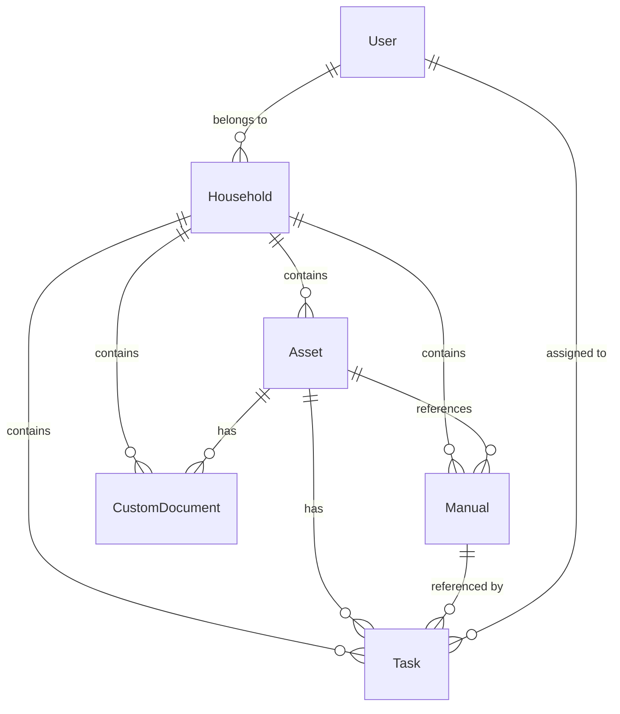

## Overview

The purpose of this document is to define how data will be modeled within the HomeKeeper application -- a service to organize home maintenance. Users can upload, search, and maintain manuals; add maintenance schedules; and create custom tasks or instructions. 
### Phases

This design is divided into three categories:

1. **MVP Functionality** - Core features to create a minimum viable (lovable) product.
2. **Planned Expansion** - Features to be implemented after MVP reached.
3. **Future Ideas** - Features that need to be reviewed and may or not be implemented later (based on feedback, needs, and product evolution). 

## Data Models

### Relationships



### Structure
* **User to Household** : A many-to-many relationship; Users can belong to multiple households and households may contain multiple users. Each household is "owned" (full administration rights) by a single user.
* **Household as a Container** : Households serve as the primary "organizational container". They contain assets, manuals, tasks, and custom documents. 
#### Assets
* **Asset References** : Assets are a focal point, with potential relationships to most of the other data models. We want to make it easy to find all information associated with a specific item. 
* **Optional Associations** : Relationships between assets and manuals/tasks/documents are optional. This allows users the flexibility to use the app as best suites them. 
#### Users
* **Creation and Ownership** : All major entities track who created them. Clear tracking makes history and permission check easier. 
* **Task Assignment** : Tasks can be assigned to users, allowing a household to delegate maintenance. 

### Design Decisions
#### One-Way vs. Two-Way Relationships
1. **The User-Household Relationship**:
   - Two-way relationship implemented through the User's `householdRoles` map and the Household's `members` array
   - Redundancy allows for efficient querying in both directions: "What households does this user belong to?" and "Which users are in this household?"

2. **Asset to Manual/Task/Document**:
   - One-way relationship from `Asset` to related entities via ID arrays
   - Simplifies finding all documentation related to an asset
   - Trade-off: Updating these relationships requires maintaining the arrays

3. **Manual to Task Relationship**:
   - One-way relationship where tasks reference manuals rather than vice versa
   - Reasoning: Tasks naturally need reference materials, while manuals exist independently of tasks

#### Embedded vs. Referenced Documents

1. **Schedule in Task**:
   - Schedule information is embedded directly in the Task document rather than as a separate entity
   - Simplifies queries when retrieving task information
   - For MVP, scheduling needs are simple and don't warrant a separate collection

2. **Completion History in Task**:
   - Task completion history is embedded as an array within the Task
   - This keeps the historical record with the task definition
   - For high-volume tasks, this might need reconsideration in the future

#### Future Extensibility

The current data model design allows for future extensions without major restructuring:

1. **Property Model**:
   - In the future we may wish to describe the properties that a household manages themselves. 
   - Can be added with minimal changes to existing models, simply adding a `propertyId` reference
   - Properties would belong to households, maintaining existing hierarchy

2. **Enhanced Permissions**:
   - The current role-based system can be expanded to a more granular permission model
   - User-household relationship structure would remain largely unchanged

3. **Asset Parts/Consumables**:
   - Can be added as a new entity with a reference to the parent asset
   - Maintains the household-based data segregation model

## Data Models for MVP

### User
The `User` represents individuals with access to HomeKeeper.

* Users can belong to multiple households, with different roles in each.
* `preferences` are user-specific and kept with the `User` to make it easier to update atomically. 
* `defaultHouseholdId` is optional to support users belonging to multiple households while still allowing them to set one as "primary"

```typescript
interface User {
  id: string;
  email: string;           // Primary login credential
  password: string;        // Hashed
  name: string;            // Display name
  preferences: {
    theme: string;
    notifications: {
      email: boolean;
      push: boolean;
    };
    defaultHouseholdId?: string;
  };
  householdRoles: {
    [householdId: string]: "owner" | "admin" | "member" | "guest"
  };
  createdAt: Date;
  updatedAt: Date;
}
```
#### Permission Handling

For MVP, the permission system uses a role-based approach with predefined capabilities for each role.

- Role-based access control simplifies permission management compared to attribute-based or resource-based models.
- Storing roles as a mapping in the User object (householdRoles) makes permission checks efficient.
- Four-tier role system (owner, admin, member, guest) covers most household sharing scenarios without unnecessary complexity.

```typescript
// Configuration (not in database)
const ROLE_CAPABILITIES = {
  "owner": [
    "manage_household", "invite_members", "remove_members",
    "create_asset", "edit_asset", "delete_asset",
    "create_manual", "edit_manual", "delete_manual", 
    "create_task", "edit_task", "delete_task",
    "create_document", "edit_document", "delete_document"
  ],
  "admin": [
    "create_asset", "edit_asset", 
    "create_manual", "edit_manual",
    "create_task", "edit_task", "delete_task",
    "create_document", "edit_document"
  ],
  "member": [
    "view_asset", "view_manual", "view_task", "complete_task",
    "view_document", "create_document", "edit_own_document"
  ],
  "guest": [
    "view_asset", "view_manual", "view_task", "view_document"
  ]
};

// Helper function for permission checks
function hasHouseholdCapability(user: User, capability: string, householdId: string): boolean {
  const role = user.householdRoles[householdId];
  if (!role) return false;
  return ROLE_CAPABILITIES[role].includes(capability);
}
```

### Household

A `Household` represents a group of assets, manuals, and maintenance tasks. Households may consist of a single user or multiple users. This is a natural segregation of data for privacy and organization.

* One-way relationship (`Household` -> `User`) chosen over a bi-directional relationship to simplify querying for members.
* `ownerId` references a single user with full administrative control, simplifying permission checks for critical operations
* Supports the case where individuals may belong to muliple households. Allows for membership ranging from administrators to guests (e.g. a maintenance person)

```typescript
interface Household {
  id: string;
  name: string;
  description?: string;
  ownerId: string;
  members: string[];
  createdAt: Date;
  updatedAt: Date;
}

```

### Asset

An `Asset` is a physical item requiring maintenance or documentation -- appliances, vehicles, equipment, etc. 

* Assets maintain a one-way relationship to manuals and tasks rather than the reverse relation, to make it easy to find all documentation related to an asset. 
* Each asset belongs to a single household, making it clear who owns what
* The model includes optional fields to maximize flexibility in how users choose to document their assets. Only essential fields are required

```typescript
interface Asset {
  id: string;
  name: string;
  description?: string;
  model?: string;
  manufacturer?: string;
  serialNumber?: string;
  purchaseDate?: Date;
  manualIds: string[];
  taskIds: string[];
  category?: string;
  tags: string[];
  householdId: string;
  createdBy: string;
  createdAt: Date;
  updatedAt: Date;
}
```

### Manual

The `Manual` model represents documentation for assets, including uploaded files and their extracted text. 

* `assetId` is optional to allow for both asset-specific and general reference documents.
* `extractedText` enables full-search capabilities
* storing `fileUrl` rather than content in the database follows best content for handling binary data. 

```typescript
interface Manual {
  id: string;
  title: string;
  description?: string;
  category?: string;
  tags: string[];
  uploadDate: Date;
  fileUrl: string;
  fileType: string;
  fileSize: number;
  extractedText?: string;
  householdId: string;
  assetId?: string;
  createdBy: string;
  createdAt: Date;
  updatedAt: Date;
}
```

### Task

A `Task` represents maintenance activities that may occur on a one-time or recurring basis. 

* `completionHistory` is stored as an array to maintain the historical record alongside the definition
* Workflow management handled through the `status` and `priority` fields

```typescript
interface Task {
  id: string;
  title: string;
  description?: string;
  relatedManualIds: string[];
  relatedCustomDocuments: string[];
  assetId?: string;
  status: "pending" | "in-progress" | "completed" | "skipped";
  priority: "low" | "medium" | "high" | "urgent";
  schedule: {
    type: "one-time" | "recurring";
    frequency?: "daily" | "weekly" | "monthly" | "quarterly" | "yearly";
    startDate: Date;
    nextOccurrence: Date;
  };
  notificationSettings: {
    enabled: boolean;
    reminderDays: number;
  };
  completionHistory: {
    date: Date;
    completedBy: string;
    notes?: string;
  }[];
  assignedTo: string[];
  householdId: string;
  createdBy: string;
  createdAt: Date;
  updatedAt: Date;
}
```

#### Scheduling

The scheduling system supports both one-time and recurring tasks with various frequency options.

- Pre-calculating and storing the nextOccurrence date improves query performance for upcoming tasks.
- The simple frequency options (daily, weekly, etc.) cover most household maintenance needs without overwhelming users with complexity.
- The scheduler function design allows for more complex patterns to be added in future versions.

```typescript
// Example scheduler service function
function calculateNextOccurrence(schedule: Schedule, from: Date = new Date()): Date {
  const fromDate = new Date(from);
  
  // One-time tasks
  if (schedule.type === "one-time") {
    return new Date(schedule.startDate);
  }
  
  // Simple recurring calculation based on frequency
  switch(schedule.frequency) {
    case "daily":
      fromDate.setDate(fromDate.getDate() + 1);
      break;
    case "weekly":
      fromDate.setDate(fromDate.getDate() + 7);
      break;
    case "monthly":
      fromDate.setMonth(fromDate.getMonth() + 1);
      break;
    case "quarterly":
      fromDate.setMonth(fromDate.getMonth() + 3);
      break;
    case "yearly":
      fromDate.setFullYear(fromDate.getFullYear() + 1);
      break;
  }
  
  return fromDate;
}
```

### CustomDocument

Users should be able to create their own documentation, complementing any manuals that they upload.

* Separate model to distinguish uploaded files and user-created content
* Content field stores rich text to support formatting needs
* Can be associated with specific assets, like manuals. 

```typescript
interface CustomDocument {
  id: string;
  title: string;
  description?: string;
  content: string;
  category?: string;
  tags: string[];
  assetId?: string;
  householdId: string;
  createdBy: string;
  createdAt: Date;
  updatedAt: Date;
}
```

### Indexing

Initial database indexes to support the MVP functionality:

```javascript
// MongoDB indexes
db.users.createIndex({ email: 1 }, { unique: true });
db.manuals.createIndex({ householdId: 1 });
db.manuals.createIndex({ title: "text", extractedText: "text", tags: 1 });
db.assets.createIndex({ householdId: 1 });
db.assets.createIndex({ name: "text", description: "text", tags: 1 });
db.tasks.createIndex({ householdId: 1 });
db.tasks.createIndex({ "schedule.nextOccurrence": 1 });
db.tasks.createIndex({ assetId: 1 });
db.customDocuments.createIndex({ householdId: 1 });
db.customDocuments.createIndex({ title: "text", content: "text", tags: 1 });
```

## Post MVP

The data models have been designed with extensibility in mind, allowing for future enhancements like:

1. **Property Support**: Enabling users to organize assets by physical location.
2. **Enhanced Scheduling**: Supporting more complex recurrence patterns.
3. **Extended Asset Details**: Tracking additional information like warranties and purchase history.
4. **Granular Permissions**: Moving to a more flexible permission model if needed.
5. **Parts and Consumables**: Tracking individual components that need regular replacement.

These extensions can be implemented without major restructuring of the core data models, demonstrating the forward-thinking nature of the initial design.

### Property Support

A `Property` models a building (or property) associated with a household. Assets may be assigned to a `Property` as a fixed asset (i.e. hot water heater) or as it's "current location" (such as a tool). 

The `Property` can be added with minimal changes to existing models, by adding a `propertyId` reference where appropriate and would belong to a `Household`  (maintaining existing hierarchy). 

```typescript
interface Property {
  id: string;              // Unique identifier
  name: string;            // Display name ("Main Home", "Lake Cottage", etc.)
  type: "house" | "apartment" | "condo" | "cottage" | "other";
  description?: string;    // Optional description
  address?: {              // Physical location
    street: string;
    city: string;
    state: string;
    postalCode: string;
    country: string;
  };
  householdId: string;     // Which household this belongs to
  createdBy: string;       // User id who created this
  createdAt: Date;
  updatedAt: Date;
}
```

### Enhanced Scheduling

Extend the Task.schedule object to include:

```typescript
schedule: {
  // Existing fields...
  interval?: number;     // e.g., 2 for "every 2 weeks"
  endDate?: Date;
  daysOfWeek?: number[]; // 0-6 for days of week
  daysOfMonth?: number[]; // 1-31 for days of month
  monthsOfYear?: number[]; // 0-11 for months
}
```

### Extended Asset Details

```typescript
interface Asset {
  // Existing fields...
  notes?: string;          // General notes about the asset
  purchasePrice?: number;  // How much it cost
  warranty?: {
    period: number;        // Warranty duration in months
    expiryDate: Date;      // Calculated warranty expiration date
    documents: string[];   // References to warranty documents (manuals)
  };
  images: string[];        // URLs to product images
}
```

### Enhanced Notifications

Extend notificationSettings in Task:

```typescript
notificationSettings: {
  enabled: boolean;
  reminderDays: number[];  // Multiple reminders (e.g., [7, 1] for 7 days and 1 day before)
  notifyUserIds: string[]; // Which users to notify
  channels: {              // Notification channels
    email: boolean;
    push: boolean;
    sms?: boolean;
  }
}
```

## Future Ideas

The following are ideas for the future, but need further review and development before committal. 

### 1. Asset Parts/Consumables Tracking

The idea here is to track consumables (such a filters, oil, etc.) or parts (e.g. if something breaks). They can be added as a new entity with references to a parent asset. We'd want to consider how to handle parts that may be shared amongst several asserts -- maybe you own two properties that use the same furnace filter. 

```typescript
interface AssetPart {
  id: string;
  assetId: string;         // The parent asset
  name: string;            // Part name
  modelNumber?: string;    // Part model/identifier
  description?: string;    // Description of the part
  purchaseUrl?: string;    // Where to buy replacements
  lastReplaced?: Date;     // When it was last replaced  
  replacementInterval?: number; // How often it should be replaced (in days)
  quantity?: number;       // How many are needed/in stock
  householdId: string;
  createdBy: string;
  createdAt: Date;
  updatedAt: Date;
}
```

### 2. Task Steps Implementation

Modeling explicit steps to accomplish a task. 

```typescript
interface Task {
  // existing fields...
  steps?: {
    order: number;
    description: string;
    isRequired: boolean;
    estimatedTime?: number; // in minutes
  }[];
}
```

### 3. Property Details Extension

```typescript
interface Property {
  // existing fields...
  details?: {              // Optional property details
    squareFootage?: number;
    yearBuilt?: number;
    purchaseDate?: Date;
    purchasePrice?: number;
  };
}
```

### 4. Extended Permission Model

If more granular or dynamic permissions are needed:

```typescript
interface Permission {
  id: string;
  name: string;           // e.g., "create_manual"
  description: string;
  scope: "system" | "household" | "property" | "asset" | "manual" | "task" | "document";
}

interface Role {
  id: string;
  name: string;           // e.g., "owner", "admin", "member"
  description: string;
  permissions: string[];  // array of permission ids
  householdId?: string;   // optional, for household-specific roles
  isSystem: boolean;      // whether this is a system-defined role
  createdBy: string;
  createdAt: Date;
  updatedAt: Date;
}
```

### 5. Categories/Tags Management

Considering having dedicated models for better tracking and organization:

```typescript
interface Category {
  id: string;
  name: string;
  description?: string;
  parentId?: string;      // For hierarchical categories
  householdId?: string;   // For household-specific categories (null = global)
  isSystem: boolean;      // Whether this is a system-defined category
  createdBy: string;
  createdAt: Date;
  updatedAt: Date;
}

interface Tag {
  id: string;
  name: string;
  householdId?: string;   // For household-specific tags (null = global)
  createdBy: string;
  createdAt: Date;
  updatedAt: Date;
}
```

### 6. Dedicated Schedule Model

As the application grows, we may want to extract schedules from `Tasks` to a separate model:

```typescript
interface Schedule {
  id: string;
  name?: string;            // Optional name for reusable schedules
  type: "one-time" | "recurring";
  frequency?: "daily" | "weekly" | "monthly" | "quarterly" | "yearly" | "custom";
  interval?: number;
  startDate: Date;
  endDate?: Date;
  daysOfWeek?: number[];    // 0-6
  daysOfMonth?: number[];   // 1-31
  monthsOfYear?: number[];  // 0-11
  customExpression?: string; // For complex schedules (e.g., cron-like)
  timeOfDay?: string;        // For time-specific schedules
  timezone?: string;
  householdId?: string;      // For household-specific schedules
  createdBy: string;
  createdAt: Date;
  updatedAt: Date;
}
```

### 7. Asset Transfer Capability

What happens when you want to sell an asset or a property? How do we transfer history and information to new owners/accounts?

```typescript
interface AssetTransfer {
  id: string;
  assetId: string;
  sourceHouseholdId: string;
  destinationHouseholdId: string;
  transferStatus: "pending" | "completed" | "rejected" | "cancelled";
  initiatedBy: string;     // User ID who started the transfer
  approvedBy?: string;     // User ID who approved the transfer
  initiatedAt: Date;
  completedAt?: Date;
  notes?: string;
}
```