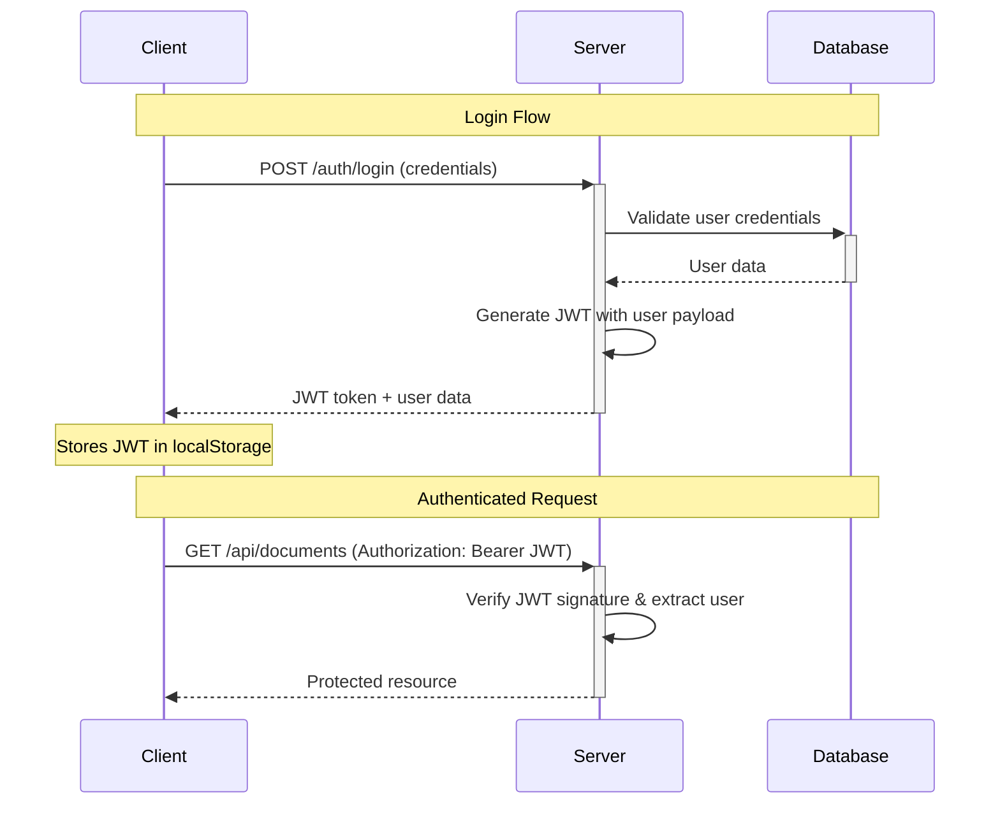
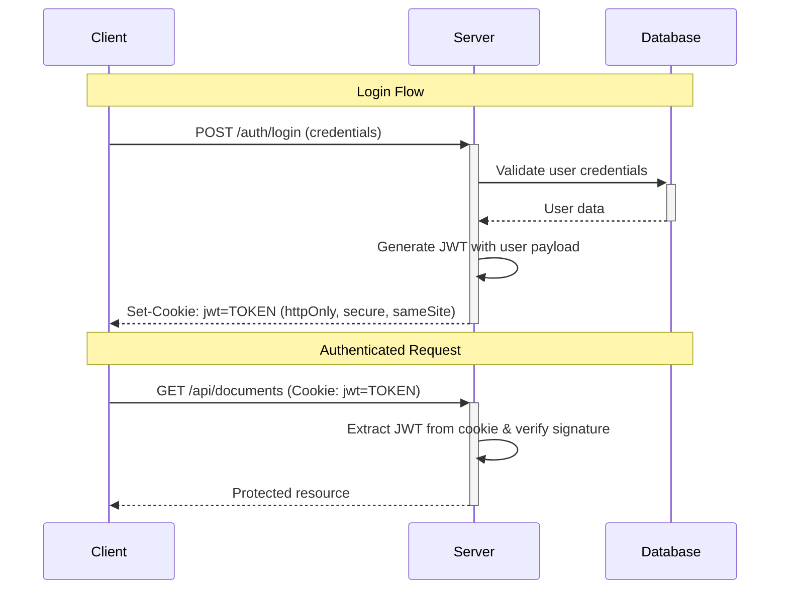
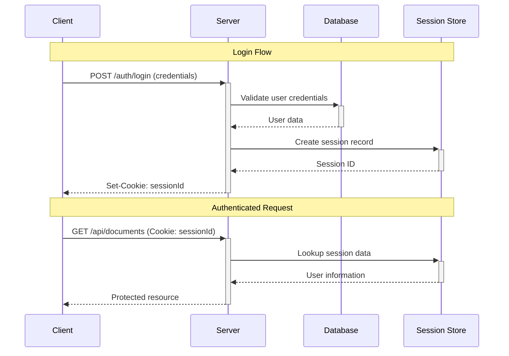
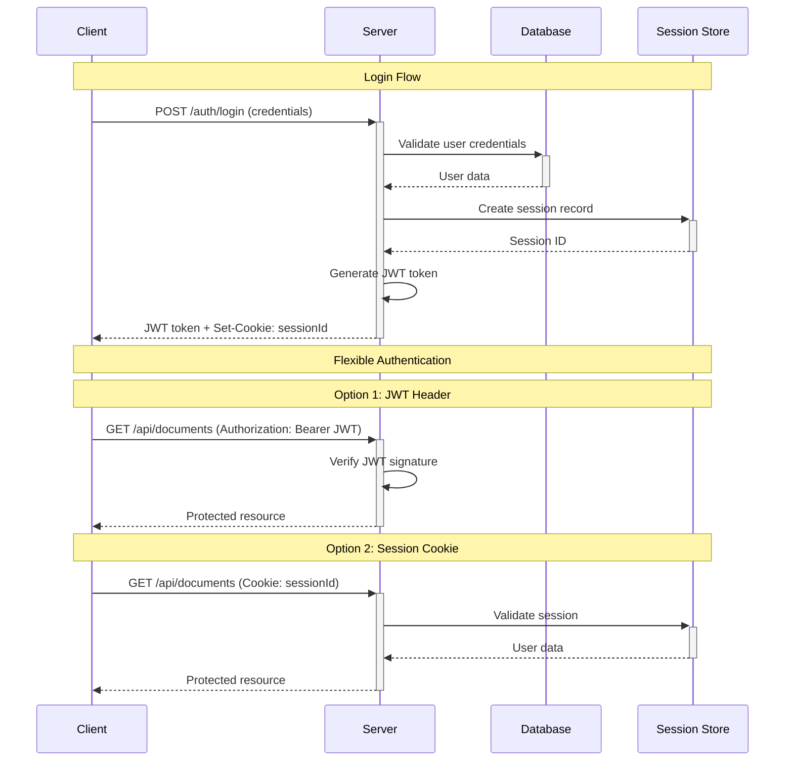

# Authentication Design Decision 

**Project:** HomeKeeper  
**Date:** May 28, 2025  
**Author:** Tom Joseph
**Version:** 1.3
**Context:** Node.js Express/React application using Passport.js for authentication

## Purpose

The purpose of this document is to record authentication design decisions for the HomeKeeper application, including the evaluation of different authentication strategies and the rationale behind our chosen approach.

## Project Context

HomeKeeper is a digital household maintenance organization service that allows users to upload, search, and maintain manuals for products within their home. Key considerations for authentication design:

- **Multi-platform target**: Web application with planned React Native mobile companion
- **Document security**: Users will upload sensitive household documents and manuals
- **Mobile-first maintenance**: Users need access while performing maintenance tasks
- **Future OAuth integration**: Potential integration with Google Drive, Dropbox for document storage
- **Scalability**: Stateless architecture preferred for future microservices expansion

## Authentication Strategy Options

### 1. JSON Web Tokens (JWT) with localStorage/Headers

**Overview:** Traditional JWT implementation where tokens are stored client-side in localStorage or sent via Authorization headers. Server validates tokens by verifying signatures without maintaining server-side state.

**Sequence Diagram:**



**Key Characteristics:**

- Client-side token storage (localStorage/sessionStorage)
- Authorization header transmission
- Vulnerable to XSS attacks
- Manual token management required

### 2. JSON Web Tokens (JWT) in HTTP-Only Cookies

**Overview:** JWT tokens stored in HTTP-only cookies, combining JWT's stateless benefits with cookie security. Server extracts JWT from cookies rather than Authorization headers, maintaining stateless architecture while improving security posture.

**Sequence Diagram:**



**Key Characteristics:**

- HTTP-only cookies prevent XSS access
- Automatic cookie transmission by browser
- CSRF protection required
- Stateless server architecture maintained

### 3. Session-Based Authentication

**Overview:** Session-based authentication maintains user state on the server, typically in a database or memory store. Clients receive session cookies that reference server-side session data.

**Sequence Diagram:**



**Key Characteristics:**

- Stateful server architecture
- Server-side session storage required
- Automatic cookie handling by browsers
- Immediate session revocation capability

### 4. Hybrid JWT + Session Approach

**Overview:** Combines both JWT and session-based authentication, providing flexibility to use either method depending on the use case and client type.

**Sequence Diagram:**



**Key Characteristics:**

- Dual authentication mechanisms
- Client flexibility in auth method
- OAuth-ready architecture
- Increased complexity

## Comparative Analysis

### Technical Comparison

|Aspect|JWT Headers|JWT Cookies|Session Only|JWT + Session|
|---|---|---|---|---|
|**Server State**|Stateless|Stateless|Stateful|Hybrid|
|**XSS Protection**|Poor|Excellent|Excellent|Variable|
|**CSRF Protection**|Excellent|Requires CSRF tokens|Requires CSRF tokens|Requires CSRF tokens|
|**Mobile Support**|Excellent|Good|Poor|Good|
|**OAuth Integration**|Complex|Medium|Simple|Simple|
|**Implementation Complexity**|Low|Medium|Low|High|
|**Token Revocation**|Difficult|Difficult|Immediate|Flexible|
|**Cross-platform Consistency**|High|Medium|Low|Medium|
|**Automatic Transmission**|Manual|Automatic|Automatic|Automatic|

### Pros and Cons Analysis

#### JWT with Headers/localStorage

**Pros:**

- ✅ Stateless architecture - easy to scale horizontally
- ✅ Perfect for mobile applications (React Native ready)
- ✅ No CSRF vulnerability (no automatic transmission)
- ✅ Works excellently with microservices architecture
- ✅ Simple CORS handling
- ✅ Explicit token management

**Cons:**

- ❌ Vulnerable to XSS attacks (localStorage accessible to scripts)
- ❌ Manual token management required
- ❌ Token revocation requires additional complexity
- ❌ Larger request headers

#### JWT with HTTP-Only Cookies

**Pros:**

- ✅ Stateless architecture maintained
- ✅ Excellent XSS protection (HTTP-only prevents script access)
- ✅ Automatic cookie transmission
- ✅ Familiar cookie-based patterns for web developers
- ✅ Combines stateless benefits with secure cookie storage
- ✅ Good mobile support (React Native handles cookies)

**Cons:**

- ❌ Requires CSRF protection
- ❌ More complex CORS configuration
- ❌ Token revocation still requires blacklisting
- ❌ Cookie size limitations
- ❌ OAuth integration requires separate token storage
- ❌ Implementation requires careful CSRF protection

#### Session-Based Authentication

**Pros:**

- ✅ Immediate logout/revocation capability
- ✅ Simple OAuth integration (all tokens stored together)
- ✅ Smaller request overhead (just session ID)
- ✅ Traditional web application pattern
- ✅ Excellent XSS protection (HTTP-only session cookies)
- ✅ Simpler security model (opaque session ID)

**Cons:**

- ❌ Requires server-side session storage and management
- ❌ Poor mobile application support
- ❌ Scaling complexity (session store clustering)
- ❌ CORS complications with cookies
- ❌ Not suitable for API-first architecture

#### JWT + Session Hybrid

**Pros:**

- ✅ Flexibility for different client types
- ✅ OAuth-ready architecture
- ✅ Can optimize for specific use cases

**Cons:**

- ❌ Increased implementation complexity
- ❌ Two authentication mechanisms to maintain
- ❌ Potential security confusion
- ❌ Higher testing overhead

## Decision: JWT in HTTP-Only Cookies

### Rationale

After evaluating all four approaches, **JWT stored in HTTP-only cookies** has been selected for HomeKeeper. This approach provides the optimal balance of security, scalability, and mobile support for our use case.

#### Why JWT Cookies Over Other Approaches

**Security Benefits:**

- **XSS Protection**: HTTP-only cookies cannot be accessed by malicious scripts, providing the same level of protection as sessions
- **Automatic Transmission**: Browsers handle cookie transmission automatically, reducing client-side complexity
- **Stateless Architecture**: Maintains JWT benefits while improving security posture

**Mobile Compatibility:**

- React Native's networking libraries handle cookies automatically
- Provides consistent authentication across web and mobile platforms
- Simpler than manual Authorization header management

**Scalability:**

- Maintains stateless architecture benefits
- No session store infrastructure required
- Ready for microservices expansion

#### Key Implementation Details

**Cookie Configuration:**

```javascript
// Production cookie settings
{
  httpOnly: true,        // Prevents XSS access
  secure: true,          // HTTPS only in production
  sameSite: 'Lax',       // CSRF protection
  maxAge: 60 * 60 * 1000 // 1 hour
}
```

**CSRF Protection Strategy:**

- Implement CSRF tokens for state-changing operations
- Use `sameSite: 'Lax'` cookie attribute
- Validate origin headers on sensitive endpoints

### Trade-offs Accepted

#### OAuth Integration Complexity

While JWT cookies work with OAuth, they require additional infrastructure compared to sessions:

**JWT + OAuth Requirements:**

- Separate storage for OAuth tokens (Redis/Database)
- Token mapping between JWT user ID and OAuth tokens
- Coordinated refresh logic for both JWT and OAuth tokens

**Implementation Strategy for Future OAuth:**

1. OAuth provider tokens stored server-side (Redis/Database) indexed by user ID
2. JWT contains user ID for mapping to stored OAuth tokens
3. OAuth-specific endpoints may use hybrid approach with temporary sessions
4. API endpoints continue using JWT for consistency

#### Other Accepted Trade-offs

1. **CSRF Complexity**: Requires CSRF protection for state-changing operations
2. **Cookie Size Limits**: JWT payload must fit within cookie size limits (~4KB)
3. **CORS Configuration**: Requires `credentials: 'include'` and proper CORS setup
4. **Token Revocation**: Requires blacklisting infrastructure for immediate revocation

### Implementation Strategy

#### Core Authentication Flow

1. User registration/login validates credentials
2. Server generates JWT with user payload
3. JWT stored in HTTP-only cookie with security flags
4. Client automatically sends cookie with requests
5. Server extracts JWT from cookie and validates signature

#### Security Measures

- **HTTP-only cookies** prevent XSS token theft
- **Secure flag** ensures HTTPS-only transmission in production
- **SameSite attribute** provides CSRF protection
- **Short token expiration** (15-30 minutes) with refresh token mechanism
- **Refresh tokens** in separate HTTP-only cookies with longer expiration
- **CSRF tokens** for state-changing operations

#### Cookie Configuration

```javascript
// Auth token cookie
res.cookie('jwt', token, {
  httpOnly: true,
  secure: process.env.NODE_ENV === 'production',
  sameSite: 'Lax',
  maxAge: 30 * 60 * 1000 // 30 minutes
});
```

#### Mobile Implementation

React Native cookie handling using libraries like `@react-native-cookies/cookies`:

```javascript
// Cookies automatically included in requests
fetch('https://api.homekeeper.com/documents', {
  credentials: 'include' // Include cookies
});
```

## Implementation Considerations

### Security Best Practices

- Use strong JWT signing algorithms (RS256 or HS256 with strong secrets)
- Implement proper token expiration and refresh mechanisms
- Store refresh tokens securely (httpOnly cookies)
- Validate and sanitize all JWT claims
- Implement rate limiting on authentication endpoints

### Monitoring and Analytics

- Track token usage patterns for security monitoring
- Monitor token refresh rates for unusual activity
- Log authentication failures for security analysis

### Future Expansion

- JWT infrastructure is ready for microservices architecture
- Token-based auth supports future API integrations
- Mobile app development can begin immediately with consistent auth
- OAuth integration will require additional token storage layer

## Conclusion

**JWT stored in HTTP-only cookies** provides the optimal balance of security, scalability, and implementation simplicity for HomeKeeper. This approach maintains JWT's stateless benefits while providing excellent XSS protection through HTTP-only cookie storage.

The decision aligns with HomeKeeper's vision of being a secure, mobile-friendly household maintenance solution while maintaining the flexibility to scale and expand features in the future. While OAuth integration will require additional complexity, the foundation supports this future expansion.

**Key benefits realized:**

- Excellent security through HTTP-only cookie storage
- Maintained stateless architecture for scalability
- Simplified client-side authentication management
- Mobile-ready implementation with automatic cookie handling
- Production-validated approach with comprehensive security features