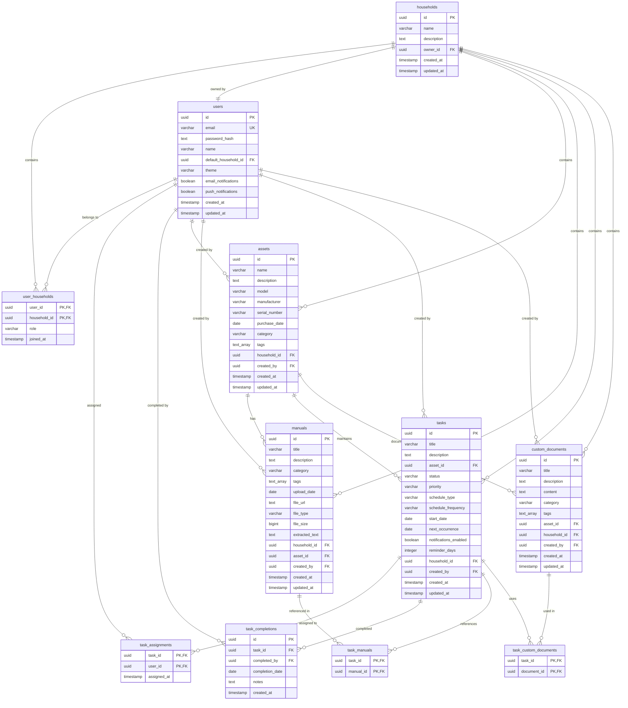

# PostgreSQL Database Design for HomeKeeper

## Overview

This document outlines the PostgreSQL database design for HomeKeeper, transitioning from the original MongoDB NoSQL design to a relational SQL structure. The design maintains all core functionality while leveraging PostgreSQL's strengths in data integrity, complex queries, and ACID transactions.

## Entity Relationship Diagram



## Database Tables Overview

| Table Name | Purpose | Key Relationships |
|------------|---------|------------------|
| `users` | User accounts and authentication | References `households` (default), links to `user_households` |
| `households` | Household containers for organizing assets/tasks | Owned by `users`, contains all other entities |
| `user_households` | Many-to-many user-household membership with roles | Junction between `users` and `households` |
| `assets` | Physical items requiring maintenance | Belongs to `households`, links to `manuals`, `tasks`, `custom_documents` |
| `manuals` | Uploaded documentation files | Belongs to `households`, optionally linked to `assets` |
| `tasks` | Maintenance activities (one-time or recurring) | Belongs to `households`, optionally linked to `assets` |
| `task_assignments` | User task assignments | Junction between `tasks` and `users` |
| `task_completions` | Historical record of completed tasks | Links `tasks` to `users` with completion details |
| `task_manuals` | Task-manual references | Junction between `tasks` and `manuals` |
| `custom_documents` | User-created documentation | Belongs to `households`, optionally linked to `assets` |
| `task_custom_documents` | Task-custom document references | Junction between `tasks` and `custom_documents` |

### Table Details

#### Primary Entity Tables

| Column | Type | Constraints | Description |
|--------|------|-------------|-------------|
| **users** | | | |
| `id` | UUID | PRIMARY KEY | Unique user identifier |
| `email` | VARCHAR(255) | UNIQUE, NOT NULL | Login credential |
| `password_hash` | TEXT | NOT NULL | Hashed password |
| `name` | VARCHAR(255) | NOT NULL | Display name |
| `default_household_id` | UUID | FK to households | User's primary household |
| `theme` | VARCHAR(50) | DEFAULT 'light' | UI theme preference |
| `email_notifications` | BOOLEAN | DEFAULT true | Email notification setting |
| `push_notifications` | BOOLEAN | DEFAULT true | Push notification setting |
| `created_at` | TIMESTAMP | DEFAULT NOW() | Record creation time |
| `updated_at` | TIMESTAMP | DEFAULT NOW() | Last update time |

| Column | Type | Constraints | Description |
|--------|------|-------------|-------------|
| **households** | | | |
| `id` | UUID | PRIMARY KEY | Unique household identifier |
| `name` | VARCHAR(255) | NOT NULL | Household display name |
| `description` | TEXT | | Optional description |
| `owner_id` | UUID | FK to users, NOT NULL | Household owner |
| `created_at` | TIMESTAMP | DEFAULT NOW() | Record creation time |
| `updated_at` | TIMESTAMP | DEFAULT NOW() | Last update time |

| Column | Type | Constraints | Description |
|--------|------|-------------|-------------|
| **user_households** | | | |
| `user_id` | UUID | FK to users, PK | User reference |
| `household_id` | UUID | FK to households, PK | Household reference |
| `role` | VARCHAR(20) | CHECK constraint | User role (owner/admin/member/guest) |
| `joined_at` | TIMESTAMP | DEFAULT NOW() | Membership start time |

| Column | Type | Constraints | Description |
|--------|------|-------------|-------------|
| **assets** | | | |
| `id` | UUID | PRIMARY KEY | Unique asset identifier |
| `name` | VARCHAR(255) | NOT NULL | Asset name |
| `description` | TEXT | | Optional description |
| `model` | VARCHAR(255) | | Product model |
| `manufacturer` | VARCHAR(255) | | Manufacturer name |
| `serial_number` | VARCHAR(255) | | Serial number |
| `purchase_date` | DATE | | Purchase date |
| `category` | VARCHAR(100) | | Asset category |
| `tags` | TEXT[] | | PostgreSQL array of tags |
| `household_id` | UUID | FK to households, NOT NULL | Owning household |
| `created_by` | UUID | FK to users, NOT NULL | Creator user |
| `created_at` | TIMESTAMP | DEFAULT NOW() | Record creation time |
| `updated_at` | TIMESTAMP | DEFAULT NOW() | Last update time |

#### Document Tables

| Column | Type | Constraints | Description |
|--------|------|-------------|-------------|
| **manuals** | | | |
| `id` | UUID | PRIMARY KEY | Unique manual identifier |
| `title` | VARCHAR(255) | NOT NULL | Manual title |
| `description` | TEXT | | Optional description |
| `category` | VARCHAR(100) | | Manual category |
| `tags` | TEXT[] | | PostgreSQL array of tags |
| `upload_date` | DATE | DEFAULT CURRENT_DATE | Upload date |
| `file_url` | TEXT | NOT NULL | File storage URL |
| `file_type` | VARCHAR(100) | NOT NULL | MIME type |
| `file_size` | BIGINT | NOT NULL | File size in bytes |
| `extracted_text` | TEXT | | OCR/extracted text for search |
| `household_id` | UUID | FK to households, NOT NULL | Owning household |
| `asset_id` | UUID | FK to assets | Optional asset association |
| `created_by` | UUID | FK to users, NOT NULL | Uploader user |
| `created_at` | TIMESTAMP | DEFAULT NOW() | Record creation time |
| `updated_at` | TIMESTAMP | DEFAULT NOW() | Last update time |

| Column | Type | Constraints | Description |
|--------|------|-------------|-------------|
| **custom_documents** | | | |
| `id` | UUID | PRIMARY KEY | Unique document identifier |
| `title` | VARCHAR(255) | NOT NULL | Document title |
| `description` | TEXT | | Optional description |
| `content` | TEXT | NOT NULL | Document content (rich text) |
| `category` | VARCHAR(100) | | Document category |
| `tags` | TEXT[] | | PostgreSQL array of tags |
| `asset_id` | UUID | FK to assets | Optional asset association |
| `household_id` | UUID | FK to households, NOT NULL | Owning household |
| `created_by` | UUID | FK to users, NOT NULL | Creator user |
| `created_at` | TIMESTAMP | DEFAULT NOW() | Record creation time |
| `updated_at` | TIMESTAMP | DEFAULT NOW() | Last update time |

#### Task Management Tables

| Column | Type | Constraints | Description |
|--------|------|-------------|-------------|
| **tasks** | | | |
| `id` | UUID | PRIMARY KEY | Unique task identifier |
| `title` | VARCHAR(255) | NOT NULL | Task title |
| `description` | TEXT | | Optional description |
| `asset_id` | UUID | FK to assets | Optional asset association |
| `status` | VARCHAR(20) | CHECK constraint, DEFAULT 'pending' | Task status |
| `priority` | VARCHAR(10) | CHECK constraint, DEFAULT 'medium' | Task priority |
| `schedule_type` | VARCHAR(20) | CHECK constraint, NOT NULL | one-time or recurring |
| `schedule_frequency` | VARCHAR(20) | CHECK constraint | Recurrence frequency |
| `start_date` | DATE | NOT NULL | Task start date |
| `next_occurrence` | DATE | NOT NULL | Next due date |
| `notifications_enabled` | BOOLEAN | DEFAULT true | Enable notifications |
| `reminder_days` | INTEGER | DEFAULT 1 | Days before to remind |
| `household_id` | UUID | FK to households, NOT NULL | Owning household |
| `created_by` | UUID | FK to users, NOT NULL | Creator user |
| `created_at` | TIMESTAMP | DEFAULT NOW() | Record creation time |
| `updated_at` | TIMESTAMP | DEFAULT NOW() | Last update time |

#### Junction Tables

| Column | Type | Constraints | Description |
|--------|------|-------------|-------------|
| **task_assignments** | | | |
| `task_id` | UUID | FK to tasks, PK | Task reference |
| `user_id` | UUID | FK to users, PK | Assigned user |
| `assigned_at` | TIMESTAMP | DEFAULT NOW() | Assignment time |

| Column | Type | Constraints | Description |
|--------|------|-------------|-------------|
| **task_completions** | | | |
| `id` | UUID | PRIMARY KEY | Unique completion record |
| `task_id` | UUID | FK to tasks, NOT NULL | Completed task |
| `completed_by` | UUID | FK to users, NOT NULL | Completing user |
| `completion_date` | DATE | DEFAULT CURRENT_DATE | Completion date |
| `notes` | TEXT | | Optional completion notes |
| `created_at` | TIMESTAMP | DEFAULT NOW() | Record creation time |

| Column | Type | Constraints | Description |
|--------|------|-------------|-------------|
| **task_manuals** | | | |
| `task_id` | UUID | FK to tasks, PK | Task reference |
| `manual_id` | UUID | FK to manuals, PK | Referenced manual |

| Column | Type | Constraints | Description |
|--------|------|-------------|-------------|
| **task_custom_documents** | | | |
| `task_id` | UUID | FK to tasks, PK | Task reference |
| `document_id` | UUID | FK to custom_documents, PK | Referenced document |

## Database Schema

### Core Tables

#### Users Table
```sql
CREATE TABLE users (
    id UUID PRIMARY KEY DEFAULT gen_random_uuid(),
    email VARCHAR(255) UNIQUE NOT NULL,
    password_hash TEXT NOT NULL,
    name VARCHAR(255) NOT NULL,
    default_household_id UUID,
    theme VARCHAR(50) DEFAULT 'light',
    email_notifications BOOLEAN DEFAULT true,
    push_notifications BOOLEAN DEFAULT true,
    created_at TIMESTAMP WITH TIME ZONE DEFAULT NOW(),
    updated_at TIMESTAMP WITH TIME ZONE DEFAULT NOW()
);
```

#### Households Table
```sql
CREATE TABLE households (
    id UUID PRIMARY KEY DEFAULT gen_random_uuid(),
    name VARCHAR(255) NOT NULL,
    description TEXT,
    owner_id UUID NOT NULL REFERENCES users(id) ON DELETE CASCADE,
    created_at TIMESTAMP WITH TIME ZONE DEFAULT NOW(),
    updated_at TIMESTAMP WITH TIME ZONE DEFAULT NOW()
);
```

#### User-Household Relationship (Many-to-Many)
```sql
CREATE TABLE user_households (
    user_id UUID REFERENCES users(id) ON DELETE CASCADE,
    household_id UUID REFERENCES households(id) ON DELETE CASCADE,
    role VARCHAR(20) NOT NULL CHECK (role IN ('owner', 'admin', 'member', 'guest')),
    joined_at TIMESTAMP WITH TIME ZONE DEFAULT NOW(),
    PRIMARY KEY (user_id, household_id)
);
```

#### Assets Table
```sql
CREATE TABLE assets (
    id UUID PRIMARY KEY DEFAULT gen_random_uuid(),
    name VARCHAR(255) NOT NULL,
    description TEXT,
    model VARCHAR(255),
    manufacturer VARCHAR(255),
    serial_number VARCHAR(255),
    purchase_date DATE,
    category VARCHAR(100),
    tags TEXT[], -- PostgreSQL array type
    household_id UUID NOT NULL REFERENCES households(id) ON DELETE CASCADE,
    created_by UUID NOT NULL REFERENCES users(id),
    created_at TIMESTAMP WITH TIME ZONE DEFAULT NOW(),
    updated_at TIMESTAMP WITH TIME ZONE DEFAULT NOW()
);
```

#### Manuals Table
```sql
CREATE TABLE manuals (
    id UUID PRIMARY KEY DEFAULT gen_random_uuid(),
    title VARCHAR(255) NOT NULL,
    description TEXT,
    category VARCHAR(100),
    tags TEXT[],
    upload_date DATE NOT NULL DEFAULT CURRENT_DATE,
    file_url TEXT NOT NULL,
    file_type VARCHAR(100) NOT NULL,
    file_size BIGINT NOT NULL,
    extracted_text TEXT,
    household_id UUID NOT NULL REFERENCES households(id) ON DELETE CASCADE,
    asset_id UUID REFERENCES assets(id) ON DELETE SET NULL,
    created_by UUID NOT NULL REFERENCES users(id),
    created_at TIMESTAMP WITH TIME ZONE DEFAULT NOW(),
    updated_at TIMESTAMP WITH TIME ZONE DEFAULT NOW()
);
```

#### Tasks Table
```sql
CREATE TABLE tasks (
    id UUID PRIMARY KEY DEFAULT gen_random_uuid(),
    title VARCHAR(255) NOT NULL,
    description TEXT,
    asset_id UUID REFERENCES assets(id) ON DELETE SET NULL,
    status VARCHAR(20) NOT NULL DEFAULT 'pending' 
        CHECK (status IN ('pending', 'in-progress', 'completed', 'skipped')),
    priority VARCHAR(10) NOT NULL DEFAULT 'medium' 
        CHECK (priority IN ('low', 'medium', 'high', 'urgent')),
    schedule_type VARCHAR(20) NOT NULL CHECK (schedule_type IN ('one-time', 'recurring')),
    schedule_frequency VARCHAR(20) CHECK (schedule_frequency IN ('daily', 'weekly', 'monthly', 'quarterly', 'yearly')),
    start_date DATE NOT NULL,
    next_occurrence DATE NOT NULL,
    notifications_enabled BOOLEAN DEFAULT true,
    reminder_days INTEGER DEFAULT 1,
    household_id UUID NOT NULL REFERENCES households(id) ON DELETE CASCADE,
    created_by UUID NOT NULL REFERENCES users(id),
    created_at TIMESTAMP WITH TIME ZONE DEFAULT NOW(),
    updated_at TIMESTAMP WITH TIME ZONE DEFAULT NOW()
);
```

### Junction Tables

#### Task Assignments (Many-to-Many)
```sql
CREATE TABLE task_assignments (
    task_id UUID REFERENCES tasks(id) ON DELETE CASCADE,
    user_id UUID REFERENCES users(id) ON DELETE CASCADE,
    assigned_at TIMESTAMP WITH TIME ZONE DEFAULT NOW(),
    PRIMARY KEY (task_id, user_id)
);
```

#### Task Completion History
```sql
CREATE TABLE task_completions (
    id UUID PRIMARY KEY DEFAULT gen_random_uuid(),
    task_id UUID NOT NULL REFERENCES tasks(id) ON DELETE CASCADE,
    completed_by UUID NOT NULL REFERENCES users(id),
    completion_date DATE NOT NULL DEFAULT CURRENT_DATE,
    notes TEXT,
    created_at TIMESTAMP WITH TIME ZONE DEFAULT NOW()
);
```

#### Task-Manual Relationships (Many-to-Many)
```sql
CREATE TABLE task_manuals (
    task_id UUID REFERENCES tasks(id) ON DELETE CASCADE,
    manual_id UUID REFERENCES manuals(id) ON DELETE CASCADE,
    PRIMARY KEY (task_id, manual_id)
);
```

#### Custom Documents Table
```sql
CREATE TABLE custom_documents (
    id UUID PRIMARY KEY DEFAULT gen_random_uuid(),
    title VARCHAR(255) NOT NULL,
    description TEXT,
    content TEXT NOT NULL,
    category VARCHAR(100),
    tags TEXT[],
    asset_id UUID REFERENCES assets(id) ON DELETE SET NULL,
    household_id UUID NOT NULL REFERENCES households(id) ON DELETE CASCADE,
    created_by UUID NOT NULL REFERENCES users(id),
    created_at TIMESTAMP WITH TIME ZONE DEFAULT NOW(),
    updated_at TIMESTAMP WITH TIME ZONE DEFAULT NOW()
);
```

#### Task-CustomDocument Relationships (Many-to-Many)
```sql
CREATE TABLE task_custom_documents (
    task_id UUID REFERENCES tasks(id) ON DELETE CASCADE,
    document_id UUID REFERENCES custom_documents(id) ON DELETE CASCADE,
    PRIMARY KEY (task_id, document_id)
);
```

## Key Design Changes from NoSQL to SQL

### 1. Normalized Relationships
- **MongoDB**: Embedded arrays (`manualIds`, `taskIds`) stored within documents
- **PostgreSQL**: Proper junction tables (`task_manuals`, `task_custom_documents`) with foreign key constraints

### 2. Data Type Conversions
- **MongoDB**: Flexible document structure with nested objects
- **PostgreSQL**: Fixed schema with appropriate data types:
  - `ObjectId` → `UUID` (more portable and secure)
  - Embedded objects → Separate tables or columns
  - Arrays → PostgreSQL arrays or junction tables

### 3. User Preferences Handling
- **MongoDB**: Nested `preferences` object within User document
- **PostgreSQL**: Flattened to individual columns (`theme`, `email_notifications`, `push_notifications`)

### 4. Schedule Information
- **MongoDB**: Embedded `schedule` object within Task
- **PostgreSQL**: Flattened to columns (`schedule_type`, `schedule_frequency`, `start_date`, `next_occurrence`)

### 5. Referential Integrity
- **MongoDB**: No built-in referential integrity
- **PostgreSQL**: Foreign key constraints ensure data consistency with proper cascade rules

## Database Indexes for Optimal Performance

### Primary Access Pattern Indexes
```sql
-- User authentication
CREATE INDEX idx_users_email ON users(email); -- Already unique

-- User-Household relationships
CREATE INDEX idx_user_households_household_id ON user_households(household_id);
CREATE INDEX idx_user_households_user_id ON user_households(user_id);
```

### Household-Based Queries (Most Common Access Pattern)
```sql
CREATE INDEX idx_assets_household_id ON assets(household_id);
CREATE INDEX idx_manuals_household_id ON manuals(household_id);
CREATE INDEX idx_tasks_household_id ON tasks(household_id);
CREATE INDEX idx_custom_documents_household_id ON custom_documents(household_id);
```

### Asset Relationship Indexes
```sql
CREATE INDEX idx_manuals_asset_id ON manuals(asset_id);
CREATE INDEX idx_tasks_asset_id ON tasks(asset_id);
CREATE INDEX idx_custom_documents_asset_id ON custom_documents(asset_id);
```

### Task Management Indexes
```sql
-- Task scheduling and status
CREATE INDEX idx_tasks_next_occurrence ON tasks(next_occurrence);
CREATE INDEX idx_tasks_status ON tasks(status);

-- Task assignments and completions
CREATE INDEX idx_task_assignments_user_id ON task_assignments(user_id);
CREATE INDEX idx_task_completions_task_id ON task_completions(task_id);
```

### Full-Text Search Indexes
```sql
-- Full-text search capabilities using GIN indexes
CREATE INDEX idx_manuals_fts ON manuals 
    USING gin(to_tsvector('english', title || ' ' || COALESCE(extracted_text, '')));

CREATE INDEX idx_assets_fts ON assets 
    USING gin(to_tsvector('english', name || ' ' || COALESCE(description, '')));

CREATE INDEX idx_custom_documents_fts ON custom_documents 
    USING gin(to_tsvector('english', title || ' ' || content));
```

### Tag Search Indexes
```sql
-- Tag searches using GIN for array operations
CREATE INDEX idx_assets_tags ON assets USING gin(tags);
CREATE INDEX idx_manuals_tags ON manuals USING gin(tags);
CREATE INDEX idx_custom_documents_tags ON custom_documents USING gin(tags);
```

### Composite Indexes for Common Query Patterns
```sql
-- Multi-column indexes for frequent query combinations
CREATE INDEX idx_tasks_household_status_next ON tasks(household_id, status, next_occurrence);
CREATE INDEX idx_manuals_household_category ON manuals(household_id, category);
CREATE INDEX idx_assets_household_category ON assets(household_id, category);
```

## Benefits of PostgreSQL over MongoDB

### 1. ACID Transactions
- **Critical for**: Financial data (purchase prices, warranties), user role changes
- **Ensures**: Data consistency across related tables during complex operations

### 2. Strong Schema Enforcement
- **Prevents**: Data inconsistencies in household/user relationships
- **Ensures**: Data quality through constraints and validation

### 3. Advanced Querying Capabilities
- **Complex JOINs**: Asset-manual-task relationships with sophisticated filtering
- **Window functions**: Advanced analytics on task completion patterns
- **CTEs and subqueries**: Complex reporting queries

### 4. Built-in Full-Text Search
- **GIN indexes**: Efficient text search across manuals and documents
- **Language support**: Stemming and ranking for English text
- **Performance**: Better than MongoDB text indexes for complex queries

### 5. Data Integrity
- **Foreign key constraints**: Prevent orphaned records automatically
- **Check constraints**: Enforce business rules at database level
- **Transactions**: Ensure consistency during multi-table operations

### 6. Mature Ecosystem
- **Tooling**: Better support for reporting, backups, monitoring
- **Extensions**: PostGIS for future location features, pg_stat_statements for performance
- **Community**: Extensive documentation and third-party tools

## Migration Considerations

### Data Migration Strategy
1. **Extract**: Export MongoDB collections to JSON
2. **Transform**: Convert document structure to relational format
3. **Load**: Import into PostgreSQL tables with proper type conversion

### Application Code Changes
- **Query patterns**: Convert MongoDB queries to SQL
- **ORM adaptation**: Update models for relational structure
- **Transaction handling**: Leverage PostgreSQL's ACID properties

### Performance Optimization
- **Query analysis**: Use `EXPLAIN ANALYZE` to optimize slow queries
- **Index monitoring**: Track index usage with `pg_stat_user_indexes`
- **Connection pooling**: Implement proper connection management

The relational model provides stronger guarantees about data consistency and enables more sophisticated querying while maintaining excellent performance through proper indexing strategies.