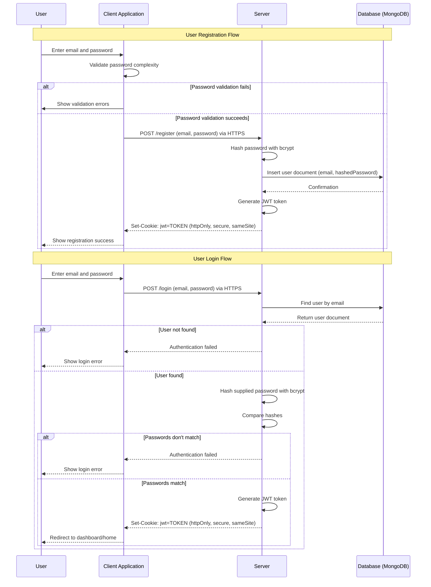

# HomeKeeper Security Strategy Document

**Project:** HomeKeeper  
**Date:** May 29, 2025  
**Author:** Tom Joseph
**Version:** 2.0

## Purpose

The purpose of this document is to outline security strategies, practices, and implementation details for HomeKeeper.

## Authentication

### Initial Implementation: Email + Password

For the MVP release, HomeKeeper will implement a traditional email and password authentication system using **Passport.js**, with the following security measures:

#### Password Storage
- Passwords will be hashed using **bcrypt** (not stored in plain text)
- Each password will use a unique salt to prevent rainbow table attacks
- Work factor of 12+ to balance security with performance
- No password requirements will be stored in the database

#### Authentication Flow
1. User registers with email and password
2. Password is validated client-side for minimum complexity requirements
3. Upon successful validation, password is transmitted to server via HTTPS
4. Server hashes the password with bcrypt and stores in the User collection
5. For login, the supplied password is hashed and compared with the stored hash
6. Upon successful authentication, server generates JWT and sets HTTP-only cookie



#### JWT Cookie Authentication
- JWT tokens stored in HTTP-only cookies for enhanced XSS protection
- Implementation of refresh token strategy:
  - Short-lived access tokens (15-30 minutes) in HTTP-only cookies
  - Longer-lived refresh tokens (7-30 days) in separate HTTP-only cookies
  - Refresh token rotation on use
- Automatic cookie transmission reduces client-side token management complexity
- Stateless server architecture maintained for scalability
- Refresh token invalidation strategy for logout and security breaches

#### Cookie Security Configuration
```javascript
// Auth token cookie
res.cookie('jwt', token, {
  httpOnly: true,                               // Prevents XSS access
  secure: process.env.NODE_ENV === 'production', // HTTPS only in production
  sameSite: 'Lax',                             // CSRF protection
  maxAge: 30 * 60 * 1000                       // 30 minutes
});

// Refresh token cookie
res.cookie('refresh_token', refreshToken, {
  httpOnly: true,                               // Prevents XSS access
  secure: process.env.NODE_ENV === 'production', // HTTPS only in production
  sameSite: 'Lax',                             // CSRF protection
  maxAge: 7 * 24 * 60 * 60 * 1000              // 7 days
});
```

#### Security Headers
- Implementation of secure headers using Helmet.js:
  - Content-Security-Policy
  - Strict-Transport-Security
  - X-Content-Type-Options
  - X-Frame-Options
  - X-XSS-Protection

### Planned Expansion: OAuth Integration

In post-MVP releases, OAuth will be implemented to provide additional authentication options:

- Integration with popular providers (Google, Apple, Microsoft)
- OAuth provider tokens stored server-side and mapped to user accounts
- Maintaining existing email/password as an option
- Account linking capabilities for users who start with email and want to add OAuth
- Handling for OAuth account recovery flows
- JWT cookie authentication maintained for API consistency

## Authorization

### Role-Based Access Control (RBAC)

HomeKeeper implements a household-centric RBAC system with four predefined roles:

#### Role Definitions
1. **Owner**
   - Full administrative control over the household
   - Can add/remove members and change their roles
   - A household can have only one owner
   - Can transfer ownership to another member

2. **Admin**
   - Can manage assets, manuals, tasks, and custom documents
   - Can invite members but cannot modify owner's role
   - Cannot delete the household

3. **Member**
   - Can view all household data
   - Can complete tasks
   - Can add/edit manuals and add own custom documents
   - Limited ability to modify core household data

4. **Guest**
   - Read-only access to household data
   - Typically for temporary access (contractors, house sitters, etc.)

#### Implementation Details

The RBAC system is implemented using a capability-based approach:

```typescript
// User model contains a map of householdIds to roles
interface User {
  // ...other fields
  householdRoles: {
    [householdId: string]: "owner" | "admin" | "member" | "guest"
  };
}

// Server-side configuration maps roles to specific capabilities
const ROLE_CAPABILITIES = {
  "owner": [
    "manage_household", "invite_members", "remove_members",
    "create_asset", "edit_asset", "delete_asset",
    "create_manual", "edit_manual", "delete_manual", 
    "create_task", "edit_task", "delete_task",
    "create_document", "edit_document", "delete_document"
  ],
  "admin": [
    "create_asset", "edit_asset", 
    "create_manual", "edit_manual",
    "create_task", "edit_task", "delete_task",
    "create_document", "edit_document"
  ],
  "member": [
    "view_asset", "view_manual", "view_task", "complete_task",
    "create_manual", "view_document", "create_document",
    "edit_own_document"
  ],
  "guest": [
    "view_asset", "view_manual", "view_task", "view_document"
  ]
};
```

Capability checks are performed on every protected API endpoint:

```typescript
function hasHouseholdCapability(user: User, capability: string, householdId: string): boolean {
  const role = user.householdRoles[householdId];
  if (!role) return false;
  return ROLE_CAPABILITIES[role].includes(capability);
}

// Example usage in an API endpoint
app.post('/api/households/:householdId/manuals', authMiddleware, (req, res) => {
  const { householdId } = req.params;
  
  if (!hasHouseholdCapability(req.user, "create_manual", householdId)) {
    return res.status(403).json({ error: "Insufficient permissions" });
  }
  
  // Continue with creating the manual
});
```

### Planned Expansion: Enhanced Authorization

Future enhancements to the authorization system may include:

- Resource-level permissions for more granular control
- Custom roles defined by household owners
- Temporary elevated permissions for specific tasks
- Activity logs for security auditing

## Data Protection

### Sensitive Data Handling

1. **Personal Identifiable Information (PII)**
   - User email addresses and names are considered PII
   - PII is only used for essential application functions
   - Users can request and download their data
   - Users can delete their account and associated data

2. **Document Security**
   - All uploaded files are stored in cloud storage (S3 or equivalent)
   - Files are referenced by UUID rather than sequential IDs
   - Access to files requires authentication and authorization
   - Files are encrypted at rest using server-side encryption

3. **Database Security**
   - MongoDB authentication enabled with strong credentials
   - Network-level isolation using VPC or equivalent
   - Regular security patches and updates
   - Database backup strategy with encryption

### API Security

1. **Rate Limiting**
   - Implementation of rate limiting on authentication endpoints
   - Graduated rate limits based on endpoint sensitivity
   - IP-based and user-based rate limiting strategies

2. **Input Validation**
   - All user inputs validated both client and server-side
   - Use of strong typing with TypeScript
   - Implementation of schema validation using the **Zod** library
   - Sanitization of inputs to prevent injection attacks

3. **CSRF Protection** (Required for Cookie-Based JWT)
   - Implementation of CSRF tokens for all state-changing operations
   - SameSite cookie attributes to prevent CSRF attacks
   - Origin header validation on sensitive endpoints
   - Double-submit cookie pattern for additional CSRF protection

4. **Cookie Security**
   - HTTP-only flags prevent XSS access to auth tokens
   - Secure flag ensures HTTPS-only transmission in production
   - SameSite attribute provides additional CSRF protection
   - Automatic cookie expiration and rotation

## Infrastructure Security

### Transport Security
- HTTPS-only communication
- TLS 1.2+ with modern cipher suites
- HTTP Strict Transport Security (HSTS)
- Certificate renewal and monitoring

### Containerization Security
- Minimal base images (Alpine-based when possible)
- Non-root users for container processes
- Read-only file systems where applicable
- Container vulnerability scanning

### Environment Variables
- Secure management of environment variables
- No hardcoded secrets in code or Docker images
- Different variable sets for development and production

## Development Practices

### Secure Coding
- Regular dependency updates and vulnerability scanning
- Code reviews with security focus
- Static analysis tools integration

### Security Testing
- Regular penetration testing
- OWASP Top 10 compliance checks
- Authentication and authorization flow testing
- CSRF protection testing for cookie-based authentication

## Incident Response

### Security Breach Protocol
1. Containment strategy for different types of breaches
2. Communication plan for affected users
3. Recovery procedures including JWT token invalidation
4. Post-incident analysis

### Logging and Monitoring
- Security-relevant events logging
- Anomaly detection for unusual authentication patterns
- Regular log reviews
- Failed authentication attempt monitoring

## Compliance Considerations

While HomeKeeper may not be subject to specific regulatory requirements initially, the security architecture will be designed with compliance in mind:

- GDPR principles (even for non-EU users)
- CCPA/CPRA considerations for California users
- SOC 2 aligned security controls

## Future Security Roadmap

1. **Two-Factor Authentication**
   - Email or SMS verification codes
   - Integration with authenticator apps
   - Recovery mechanisms
   - Enhanced security for sensitive operations

2. **Advanced Threat Protection**
   - Brute force protection with progressive delays
   - Failed login attempt tracking and alerting
   - Suspicious activity notifications
   - Device fingerprinting for anomaly detection

3. **Enhanced Data Encryption**
   - End-to-end encryption for sensitive document content
   - Client-side encryption options
   - Encrypted backup strategy

4. **Security Dashboards**
   - User access logs viewable by household owners
   - Failed login attempt notifications
   - Activity audit trails
   - Real-time security alerts